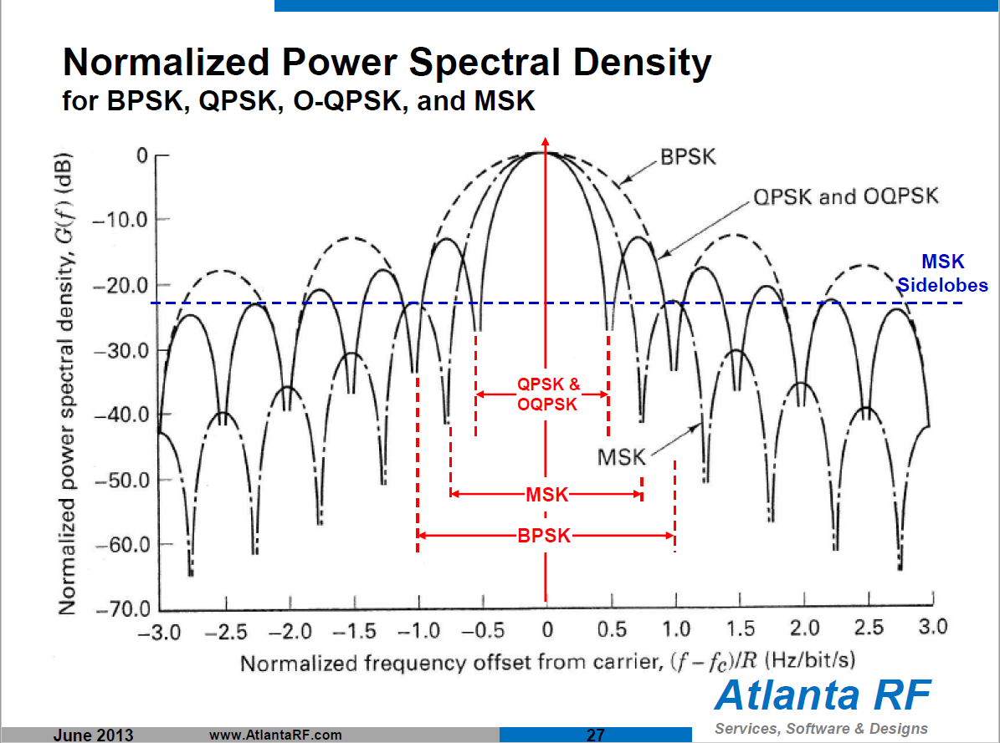

# Modulation and coding \(FEC\)

## I. Down-link

## 3.1. Technical survey

The main features of existing equipment are shown in table 3.1

#### Table 3.1 Modulation and FEC of real cubesat S-band transceivers

| Title | Modulation | FEC |
| --- | --- | --- | --- | --- | --- | --- |
| [ NanoCom SR2000](https://gomspace.com/UserFiles/Subsystems/datasheet/gs-ds-nanocom-sr2000-10.pdf) | Filtered QPSK \( Square root raised cosine filter, 𝛼 = 0.2\) | Concatenated coding: convolutional code plus Reed-Solomon \[C\(7, ½\) and RS \(255, 223\), interleaving depth 𝐿 = 8\] |
| [ISIS TXS High Data Rate S-Band Transmitter](https://www.cubesatshop.com/product/isis-txs-s-band-transmitter/) | OQPSK \( Pulse shaping: Square Root Raised Cosine, Roll-off 0.5, 0.35\) | Concatenated Reed Solomon and Convolutional coding \[C\(7, ½\) and RS \(255, 223\)\] |
| [ISIS TXS High Data Rate S-Band Transmitter](https://www.cubesatshop.com/product/isis-txs-s-band-transmitter/) | DQPSK | TURBO code, rate =0.489 |
| [S Band Transceiver for Small Satellites \( IQ wireless GmbH\)](http://www.iq-wireless.com/images/pdf/SLINK-Datasheet.pdf) | BPSK/QPSK/8PSK/QAM16 | Convolutional code, r=0.5 / 0.75 |
| [Full-duplex Low-power S-band Transceiver \(Nano Avionics\)](https://n-avionics.com/cubesat-components/communication-systems/cubesat-s-band-transceiver/) | GMSK modulation \(BT=0.35\) | Configurable Reed-Solomon and convolutional coding forward error correction |
| [CDMA communication system performance for a constellation of CubeSats around the Moon \(IEEE paper\)](https://ieeexplore.ieee.org/document/7500710/) | filtered offset QPSK with phase modulation \(a CCSDS standard\) \(OQPSK/PM\) | LDPC r=0.5 |

[More examples](https://ntrs.nasa.gov/archive/nasa/casi.ntrs.nasa.gov/20160007683.pdf).

## 3.2. Modulation schemes

### M-PSK vs. M-QAM/M-ASK

Amplitude modulations usually [is not used in satellite communications](https://www.quora.com/Why-is-amplitude-modulation-not-used-in-satellite-communication) due to large power \(and hence amplitude\) losses.

### M-PSK vs. M-FSK

Frequency modulation schemes is not usually used in satellite communications due to their relatively low spectral efficiency and difficulties with coherent detection.

**Tab. 3.2. Spectral efficient values \(bit/s/Hz\) for different modulation orders \[1\].** 

| **Modulation scheme / Modulation order** | 2 | 4 | 8 | 16 | 32 | 64 |
| --- | --- | --- |
| M-PSK | 0.5 | 1 | 1.5 | 2 | 2.5 | 3 |
| M-FSK | 1 | 1 | 0.75 | 0.5 | 0.3125 | 0.1875 |

### QPSK vs. BPSK

The same BER \(Bit-error ratio\) performance in AWGN \(Additive White Gaussian Noise\) channel:

$$
P_b = Q\left(\sqrt{\frac{2E_b}{N_0}}\right) = \frac{1}{2}erfc \left(\sqrt{\frac{E_b}{N_0}} \right)
$$

where  $$Q(*)$$ is the Marcum Q-function, $$ E_b $$ is the energy per bit and $$ N_0 $$ is the power spectral density.

QPSK has two twice as larger throughput \(2 bits per symbol\).

| **Modulation** | **BPSK** | **QPSK** |
| --- | --- |
| Spectral efficiency | 0.5 | 1 |

Practically, BPSK is more robust due to its simplicity.

### QPSK vs. OQPSK

Envelope of  π/4-QPSK \(modification of the QPSK\) has already no zeros crossings. However the possibility of 135 degrees phase jumps still exists in this case. This will have negative impact on spectral characteristics. One solution to avoid this, is to use Offset QPSK \(OQPSK\).

  

The sequence in the Q-branch is delayed by $$T_0 = T/2$$, where T is channel symbol duration \(by 1 bit duration\). With this operation 180 degrees phase jumps are avoided and hence deep distortions in envelope will not occur.

The same theoretical BER performance. 

### QPSK vs. MSK

**Advantages** of the MSK \(cited by  [Link Budget Analysis: Digital Modulation-Part 2-FSK \(1.2MB pdf\) Oct-2013](http://www.atlantarf.com/Downloads.php)\):

> * A MSK modulated signal has continuous phase in all cases, while a QPSK modulated signal has phase shifts of π or π/2. 
> * MSK signal does not have amplitude variations. 
> *  99% of MSK power is in main lobe. QPSK: 90%. 
> *  MSK modulated signals have lower side-lobes \(- 23dB\) than QPSK signals \(–10 dB\). Hence interchannel interference \(ICI\) is significantly larger in QPSK modulated signals. 
> * To avoid ICI, QPSK requires filtering, which can change the amplitude and phase of the QPSK waveform. Not required for MSK modulation. 
> * Distance between signal points is the same in QPSK and MSK. Probability of bit error in an additive white Gaussian noise channel \(AWGN\) is also the same.

**Disadvantages** of the MSK \(cited by  [Link Budget Analysis: Digital Modulation-Part 2-FSK \(1.2MB pdf\) Oct-2013](http://www.atlantarf.com/Downloads.php)\):

> * Null-to-Null RF transmission bandwidth of MSK is: Bnull = 1.5fb , which is 50% larger then the null-to-null bandwidth for QPSK, which is Bnull = fb . 
> * However, MSK can transmit 99% of the signal power within a bandwidth of 1.2fb . QPSK requires around 8fb to transmit the same signal power. 
> * Generation and detection of a MSK modulated signal is slightly complex. 
> * Phase jitter may be present in MSK because of incorrect synchronization, which can degrade performance. 
> * Main lobe of MSK is wide. Unsuitable for applications where extremely narrow bandwidths and sharp cut-offs are required. 
> * Slow decay of MSK’s Power Spectral Density can create adjacent interchannel interference: ICI. As such, MSK modulation is not suitable for multiuser communications, but can be overcome using Gaussian MSK: GMSK.

### MSK vs. GMSK

**Motivation** to the GMSK \(cited by [\[2\]](https://www.researchgate.net/publication/315258808_Estimation_techniques_for_GMSK_using_linear_detectors_in_satellite_communications)\):

> One of the methods for achieving this is the use of more bandwidth-efficient modulations, especially those best suited for use with nonlinear power amplifiers. Gaussian minimum shift keying \(GMSK\) is a popular waveform choice for bandwidth-constrained systems using nonlinear amplifiers. Since GMSK is a constant envelope modulation, nonlinear amplification does not produce spectral “regrowth” in the transmitted waveform. The instantaneous frequency is smoothed by a Gaussian low-pass filter to produce a signal with excellent spectral containment. The 3 dB bandwidth of the Gaussian low-pass smoothing filter can be adjusted to provide the system designer with a trade-off between detection efficiency and occupied bandwidth. GMSK has much better spectral containment than binary phase-shift keying \(BPSK\), quaternary phase-shift keying \(QPSK\), and offset QPSK which are used in the many of the current SATCOM systems.

**Advantages** of the GMSK \(cited by  [Link Budget Analysis: Digital Modulation-Part 2-FSK \(1.2MB pdf\) Oct-2013](http://www.atlantarf.com/Downloads.php)\):

> Data stream is first shaped with a pre-modulation linear Gaussian lowpass filter, which smoothes the phase trajectory of the MSK signal, before being applied to a frequency modulator. This has the advantage of reducing side-band power, which reduces out-of-band interference between signal carriers in adjacent frequency channels \(i.e. lower side-lobe RF power levels\).

**Disadvantages** of the GMSK \(cited by  [Link Budget Analysis: Digital Modulation-Part 2-FSK \(1.2MB pdf\) Oct-2013](http://www.atlantarf.com/Downloads.php)\):

> As the bandwidth of the Gaussian lowpass filter is lowered, the amount of Inter-Symbol Interference \(ISI\) increases.

$$
P_{e,GMSK} =Q\left(\sqrt{\frac{2\lambda E_b}{N_0}}\right)  = \frac{1}{2}erfc\left( \sqrt{\frac{\lambda E_b}{N_0}}\right)
$$

| $$B_{3dB}T_b$$  | $$\lambda$$  |
| --- | --- | --- |
| 0.25 | 0.68 |
| $$\infty$$  | 0.85 |

### Shaped OQPSK vs. conventional OQPSK

Pulse shaping motivation \(cited by  [Root Raised Cosine Filters & Pulse Shaping in Communication Systems](https://ntrs.nasa.gov/archive/nasa/casi.ntrs.nasa.gov/20120008631.pdf)\)

> This presentation briefly discusses application of the Root Raised Cosine \(RRC\) pulse shaping in the space telecommunication. Use of the RRC filtering \(i.e., pulse shaping\) is adopted in commercial communications, such as cellular technology, and used extensively. However, its use in space communication is still relatively new. This will possibly change as the crowding of the frequency spectrum used in the space communication becomes a problem. The two conflicting requirements in telecommunication are the demand for high data rates per channel \(or user\) and need for more channels, i.e., more users. Theoretically as the channel bandwidth is increased to provide higher data rates the number of channels allocated in a fixed spectrum must be reduced. Tackling these two conflicting requirements at the same time led to the development of the RRC filters. More channels with wider bandwidth might be tightly packed in the frequency spectrum achieving the desired goals. A link model with the RRC filters has been developed and simulated. Using 90% power Bandwidth \(BW\) measurement definition showed that the RRC filtering might improve spectrum efficiency by more than 75%. Furthermore using the matching RRC filters both in the transmitter and receiver provides the improved Bit Error Rate \(BER\) performance.

Impulse response of the filter:

With decreasing of the roll-off  factor $$ \beta$$ we have more compact frequency response \(more efficient usage of the spectrum\):    

  
However, $$\beta = 0$$ is the ideal case with difficulties of implementation in reality. Theoretically, decreasing of the roll-off factor increases ISI \(intersymbol interference\), however, in practice, it could be negligible.

Comparison of the different waveforms in terms of spectral efficiency and BER performance is done in [\[3\]](https://ieeexplore.ieee.org/document/904973/).

### Shaped OQPS vs. MSK/GMSK

Pulse Shaped OQPSK \(SOQPSK\) can be represented as continuous phase modulation \(CPM\) [\[4\]](https://pdfs.semanticscholar.org/f025/2fa31444fad6a5090527d73f87352137c9b8.pdf).

Minimum shift keying \(MSK\) is the partial case of the Continuous Phase Frequency Shift keying \(CPFSK\) and therefore of the CPM. MSK waveform can also be designed as OQPSK with the sinusoidal pulse shaping \[5, 6\]. 

However, it should be taken into account that MSK \(GMSK\) is the [partial case of the 2-FSK](https://www.quora.com/How-many-bits-per-symbol-are-transmitted-in-MSK). OQPSK is the quadrature modulation scheme and has the same throughput as QPSK or 4-QAM.

## 3.3. Channel coding \(FEC\)

As we can see from table 3.1 very popular option of the FEC is [RSC \(Reed-Solomon convolutional\) concatenated codes](http://www.scholarpedia.org/article/Concatenated_codes). It relates to deep-space communication standartd \(fig. 3.1\) that allows to achieve sufficiently high BER performance \(fig. 3.2\).

![ Deep-space concatenated coding system. \[8, p. 433\]](.gitbook/assets/rsc.png)

### Turbo codes vs. RSCC

Very interesting research can be found also in [\[9\]](https://publik.tuwien.ac.at/files/publik_262129.pdf)  where capabilities of [Turbo convolutional](http://www.scholarpedia.org/article/Turbo_code), LDPC  and Polar codes are considered. 

Turbo codes outperform RSCC in terms of theoretical BER performance.

![Bit error rate curves for several codes with rates near 1/6: k &#xBC; 1784 and k&#xBC; 8920 turbo codes and the \(n &#xBC; 255, k&#xBC; 223\) Reed&#x2013;Solomon code concatenated with a constraint length N &#xBC; 15, rate 1/6 convolutional code. \[10\]](.gitbook/assets/turbovsrs%20%284%29.png)

Since 2000-s modern error correction schemes are used more widely in space communications.

![Codes Used by NASA Missions \[10\]](.gitbook/assets/image%20%2814%29.png)

### Turbo codes vs. LDPC

**LDPC disadvanges** \(cited by [\[10\]](https://ieeexplore.ieee.org/document/4383367/)\):

> Turbo codes were the first of the modern iteratively decoded codes to become practical. LDPC codes followed and have proven very versatile, but they have not replaced turbo codes, or even the traditional block and convolutional codes. LDPC codes are decoded on a parity check matrix, and this matrix grows larger as the code rate is decreased, making low-rate LDPC decoders more complex. In contrast, turbo codes are decoded on trellises, with one trellis section per information bit, corresponding to several code symbols. Hence turbo codes remain superior to LDPC codes at low rates. Iterative decoding, of either turbo or LDPC codes, remains complex relative to either Viterbi decoding of convolutional codes or to algebraic decoding techniques for Reed–Solomon and other block codes. When decoding complexity is constrained, as it is in highdata- rate applications, the traditional codes remain unbeaten. It is unknown if there are fundamental reasons why these different niches require different coding solutions. It is quite possible that good LDPC codes based on generator matrices will be found, and that low complexity LDPC decoding algorithms will be discovered. If so, perhaps LDPC codes will eventually solve all coding problems.

**Turbo codes disadvantages** \(cited by wikipedia article\)

In other hand,  BER performance of the Turbo codes are influenced by low weight codes  limitation \[7 , p.614\]. This phenomenon indirectly means that for decreasing of the BER in fixed SNR only decreasing of the code rate \(and hence of the net bit rate\) can be used.

LDPC codes have no limitations of minimum distance \(cited by \[7, p. 653\]\):

> LDPC codes have excellent distance properties. Gallager showed that for random LDPC codes, the minimum distance dmin between codewords increases with N \[code word length\] when column and row weights are held fixed \[ 112, p. 51\], that is, as they become increasingly sparse. Sequences of LDPC codes as N -&gt; inf have been proved to reach channel capacity \[217\].

That indirectly means that LDPC codes may be more efficient on relatively large code rates \(e.g. 3/4, 5/6, 7/8\) than Turbo codes.

In the [following reference](https://www.nt.tuwien.ac.at/wp-content/uploads/2016/10/DC2-16_Ch7_LDPC.pdf) comparison formulated as:

> LDPC codes have certain advantages over turbo codes: 
>
> • They tend to have a better block error performance, and a better performance on bursty channels. 
>
> • They are more amenable to high rates, and in fact can be designed for almost any rate and blocklength. \(In contrast, the rate of turbo codes is usually adjusted by means of a puncturing scheme, which necessitates an additional design step.\) 
>
> • Their error floor tends to occur at a lower BER. 
>
> • The encoder and decoder do not require interleavers. 
>
> • A single LDPC code can be universally good for a collection of channels. 
>
> • There exist iterative LDPC decoding algorithms that are easy to implement, have moderate complexity \(which scales linearly with the blocklength\), and are parallelizable in hardware. In particular, LDPC decoding using the belief propagation \(sum-product\) algorithm tends to be less complex than turbo decoding using the BCJR algorithm. 
>
> • LDPC decoders inherently check if a codeword satisfying the check equations has been found, and otherwise declare a decoding failure. \(In contrast, turbo decoders usually need to perform additional operations to compute a stopping criterion, and even then it is not clear if the decoding result corresponds to a codeword satisfying the check equations.\) 
>
> LDPC codes also have certain disadvantages relative to turbo codes: 
>
> • In general, the encoding complexity is higher than for turbo codes. \(However, there are special LDPC code constructions with low encoding complexity.\) 
>
> • Iterative LDPC decoding typically requires many more iterations than iterative turbo decoding, which may lead to a higher latency. \(The complexity per iteration is much lower, though.\)

## II. Up-link

## 3.4. Modulation schemes

## 3.5. Channel coding schemes

## References

\[1\]  Haykin S. Communication systems. – John Wiley & Sons, 2008. - p. 368, 402 

\[2\] Rice, M., Oliphant, T., & Mcintire, W. \(2007\). Estimation techniques for GMSK using linear detectors in satellite communications. IEEE Transactions on Aerospace and Electronic Systems, 43\(4\).

\[3\]  Hill, Terrance J. "A non-proprietary, constant envelope, variant of shaped offset QPSK \(SOQPSK\) for improved spectral containment and detection efficiency." MILCOM 2000. 21st Century Military Communications Conference Proceedings. Vol. 1. IEEE, 2000.

\[4\]  Li, Lifang, and M. K. Simon. "Performance of coded offset quadrature phase-shift keying \(OQPSK\) and MIL-STD shaped OQPSK \(SOQPSK\) with iterative decoding." Interplanetary Network Prog. Rep. 42 \(2004\).

\[5\] Proakis J. G. Digital communications. 1995 //McGraw-Hill, New York. – p. 126-128

\[6\] Anderson J. B., Aulin T., Sundberg C. E. Digital phase modulation. – Springer Science & Business Media, 2013. – p.49-50

\[7\] Moon Todd, K. Error correction coding: mathematical methods and algorithms. 2005 by John Wiley & Sons. ISBN 0-471-64800-0.

\[8\] J. Hagenauer, E. Offer, and L. Papke, Reed Solomon Codes and Their Applications. New York IEEE Press, 1994

\[9\] Tahir, Bashar, Stefan Schwarz, and Markus Rupp. "BER comparison between Convolutional, Turbo, LDPC, and Polar codes." Telecommunications \(ICT\), 2017 24th International Conference on. IEEE, 2017.

\[10\]  Andrews, Kenneth S., et al. "The development of turbo and LDPC codes for deep-space applications." Proceedings of the IEEE 95.11 \(2007\): 2142-2156.

