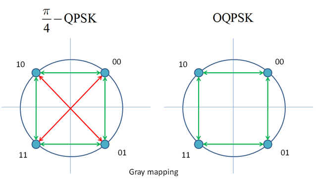

# Modulation and coding \(FEC\)

## Technical survey

The main features of existing equipment are shown in table 3.1

#### Table 3.1 Modulation and FEC of real cubesat S-band transceivers

| Title | Modulation | FEC |
| --- | --- | --- | --- | --- | --- | --- |
| [ NanoCom SR2000](https://gomspace.com/UserFiles/Subsystems/datasheet/gs-ds-nanocom-sr2000-10.pdf) | Filtered QPSK \( Square root raised cosine filter, 𝛼 = 0.2\) | Concatenated coding: convolutional code plus Reed-Solomon \[C\(7, ½\) and RS \(255, 223\), interleaving depth 𝐿 = 8\] |
| [ISIS TXS High Data Rate S-Band Transmitter](https://www.cubesatshop.com/product/isis-txs-s-band-transmitter/) | OQPSK \( Pulse shaping: Square Root Raised Cosine, Roll-off 0.5, 0.35\) | Concatenated Reed Solomon and Convolutional coding \[C\(7, ½\) and RS \(255, 223\)\] |
| [ISIS TXS High Data Rate S-Band Transmitter](https://www.cubesatshop.com/product/isis-txs-s-band-transmitter/) | DQPSK | TURBO code, rate =0.489 |
| [S Band Transceiver for Small Satellites \( IQ wireless GmbH\)](http://www.iq-wireless.com/images/pdf/SLINK-Datasheet.pdf) | BPSK/QPSK/8PSK/QAM16 | Convolutional code, r=0.5 / 0.75 |
| [Full-duplex Low-power S-band Transceiver \(Nano Avionics\)](https://n-avionics.com/cubesat-components/communication-systems/cubesat-s-band-transceiver/) | GMSK modulation \(BT=0.35\) | Configurable Reed-Solomon and convolutional coding forward error correction |
| [CDMA communication system performance for a constellation of CubeSats around the Moon \(IEEE paper\)](https://ieeexplore.ieee.org/document/7500710/) | filtered offset QPSK with phase modulation \(a CCSDS standard\) \(OQPSK/PM\) | LDPC r=0.5 |

[More examples](https://ntrs.nasa.gov/archive/nasa/casi.ntrs.nasa.gov/20160007683.pdf).

## Modulation

### M-PSK vs. M-QAM/M-ASK

Amplitude modulations usually is not used in satellite communications due to large power \(and hence amplitude\) losses.

### M-PSK vs. M-FSK

Frequency modulation schemes is not usually used in satellite communications due to their relatively low spectral efficiency and difficulties with coherent detection.

### QPSK vs. BPSK

The same AWGN \(Additive White Gaussian Noise\) BER \(Bit-error ratio\) performance:

$$
P_b = Q\left(\sqrt{\frac{2E_b}{N_0}}\right) = \frac{1}{2}erfc \left(\sqrt{\frac{E_b}{N_0}} \right)
$$

where  $$Q(*)$$ is the Marcum Q-function, $$ E_b $$ is the energy per bit and $$ N_0 $$ is the power spectral density.

QPSK has two times larger throughput \(2 bits per symbol\).

| **Modulation** | **BPSK** | **QPSK** |
| --- | --- |
| Spectral efficiency | 0.5 | 1 |

Practically, BPSK is more robust due to its simplicity.

### QPSK vs. OQPSK

Envelope of π/4-QPSK has no zeros crossings.However the possibility of 180 degrees phase jumps still exists in this case. This will have negative impact on spectral characteristics. One solution to avoid this, is to use Offset QPSK \(OQPSK\).

The sequence in the Q-branch is delayed by $$T_0 = T/2$$, where T is channel symbol duration \(by 1 bit\). With this operation 180 degrees phase jumps are avoided and hence deep distortions in envelope will not occur.

The same BER performance. 

### QPSK vs. MSK

**Advantages** of the MSK \(cited by  [Link Budget Analysis: Digital Modulation-Part 2-FSK \(1.2MB pdf\) Oct-2013](http://www.atlantarf.com/Downloads.php)\):

> * A MSK modulated signal has continuous phase in all cases, while a QPSK modulated signal has phase shifts of π or π/2. 
> * MSK signal does not have amplitude variations. 
> *  99% of MSK power is in main lobe. QPSK: 90%. 
> *  MSK modulated signals have lower side-lobes \(- 23dB\) than QPSK signals \(–10 dB\). Hence interchannel interference \(ICI\) is significantly larger in QPSK modulated signals. 
> * To avoid ICI, QPSK requires filtering, which can change the amplitude and phase of the QPSK waveform. Not required for MSK modulation. 
> * Distance between signal points is the same in QPSK and MSK. Probability of bit error in an additive white Gaussian noise channel \(AWGN\) is also the same.

**Disadvantages** of the MSK \(cited by  [Link Budget Analysis: Digital Modulation-Part 2-FSK \(1.2MB pdf\) Oct-2013](http://www.atlantarf.com/Downloads.php)\):

> * Null-to-Null RF transmission bandwidth of MSK is: Bnull = 1.5fb , which is 50% larger then the null-to-null bandwidth for QPSK, which is Bnull = fb . 
> * However, MSK can transmit 99% of the signal power within a bandwidth of 1.2fb . QPSK requires around 8fb to transmit the same signal power. 
> * Generation and detection of a MSK modulated signal is slightly complex. 
> * Phase jitter may be present in MSK because of incorrect synchronization, which can degrade performance. 
> * Main lobe of MSK is wide. Unsuitable for applications where extremely narrow bandwidths and sharp cut-offs are required. 
> * Slow decay of MSK’s Power Spectral Density can create adjacent interchannel interference: ICI. As such, MSK modulation is not suitable for multiuser communications, but can be overcome using Gaussian MSK: GMSK.

| **Modulation** | **QPSK** | **MSK** |
| --- | --- |
| Spectral efficiency | 1 | 0.667 |

### MSK vs. GMSK

**Motivation** to the GMSK \(cited by [\[1\]](https://www.researchgate.net/publication/315258808_Estimation_techniques_for_GMSK_using_linear_detectors_in_satellite_communications)\):

> One of the methods for achieving this is the use of more bandwidth-efficient modulations, especially those best suited for use with nonlinear power amplifiers. Gaussian minimum shift keying \(GMSK\) is a popular waveform choice for bandwidth-constrained systems using nonlinear amplifiers. Since GMSK is a constant envelope modulation, nonlinear amplification does not produce spectral “regrowth” in the transmitted waveform. The instantaneous frequency is smoothed by a Gaussian low-pass filter to produce a signal with excellent spectral containment. The 3 dB bandwidth of the Gaussian low-pass smoothing filter can be adjusted to provide the system designer with a trade-off between detection efficiency and occupied bandwidth. GMSK has much better spectral containment than binary phase-shift keying \(BPSK\), quaternary phase-shift keying \(QPSK\), and offset QPSK which are used in the many of the current SATCOM systems.

**Advantages** of the GMSK \(cited by  [Link Budget Analysis: Digital Modulation-Part 2-FSK \(1.2MB pdf\) Oct-2013](http://www.atlantarf.com/Downloads.php)\):

> Data stream is first shaped with a pre-modulation linear Gaussian lowpass filter, which smoothes the phase trajectory of the MSK signal, before being applied to a frequency modulator. This has the advantage of reducing side-band power, which reduces out-of-band interference between signal carriers in adjacent frequency channels \(i.e. lower side-lobe RF power levels\).

**Disadvantages** of the GMSK \(cited by  [Link Budget Analysis: Digital Modulation-Part 2-FSK \(1.2MB pdf\) Oct-2013](http://www.atlantarf.com/Downloads.php)\):

> As the bandwidth of the Gaussian lowpass filter is lowered, the amount of Inter-Symbol Interference \(ISI\) increases.

$$
P_{e,GMSK} =Q\left(\sqrt{\frac{2\lambda E_b}{N_0}}\right)  = \frac{1}{2}erfc\left( \sqrt{\frac{\lambda E_b}{N_0}}\right)
$$

| $$B_{3dB}T_b$$  | $$\lambda$$  |
| --- | --- | --- |
| 0.25 | 0.68 |
| $$\infty$$  | 0.85 |

### Shaped OQPSK vs. conventional OQPSK

### Shaped OQPS vs. MSK/GMSK

## Channel coding \(FEC\)

As we can see from table 3.1 very popular option of the FEC is RSC \(Reed-Solomon convolutional\) concatenated codes. It relates to deep-space communication standartd \(fig. 3.1\) that allows to achieve sufficiently high BER performance \(fig. 3.2\).

![ Fig. 3.1. Deep-space concatenated coding system. \[1, p. 433\]](.gitbook/assets/rsc.png)

![Fig. 3.2. Typical performance curves for concatenated and unconcatenated coding systems for the space channel \(AWGN\) \[2, p.27\]](.gitbook/assets/rsc-2.png)

  
Very interesting research can be found also in [\[3\]](https://publik.tuwien.ac.at/files/publik_262129.pdf)  where capabilities of Turbo convolutional , LDPC  and Polar codes are considered. 

Morover, according to[ \[4\]](https://ieeexplore.ieee.org/document/7095355/), in general,  Turbo codes have the similar computational complexity with RSC codes.

## References

\[1\] Rice, M., Oliphant, T., & Mcintire, W. \(2007\). Estimation techniques for GMSK using linear detectors in satellite communications. IEEE Transactions on Aerospace and Electronic Systems, 43\(4\).

\[1\] Moon Todd, K. Error correction coding: mathematical methods and algorithms. 2005 by John Wiley & Sons. ISBN 0-471-64800-0.

\[2\] J. Hagenauer, E. Offer, and L. Papke, Reed Solomon Codes and Their Applications. New York IEEE Press, 1994

\[3\] Tahir, Bashar, Stefan Schwarz, and Markus Rupp. "BER comparison between Convolutional, Turbo, LDPC, and Polar codes." Telecommunications \(ICT\), 2017 24th International Conference on. IEEE, 2017.

\[4\] Balaji, Pavithra,u et al. "Evaluaton of decoding trade-ofs of concatenated RSconvolutonal codes and turbo codes via trellis." Signal Pricessing andIntegrated Netwirks \(SPIN\), 2015 2nd Internatinal Cinference in. IEEE, 2015

