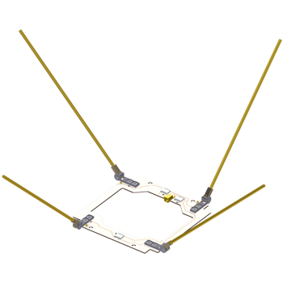
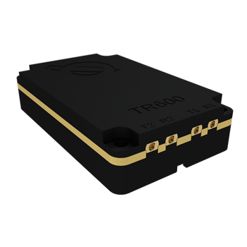
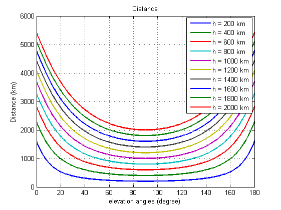
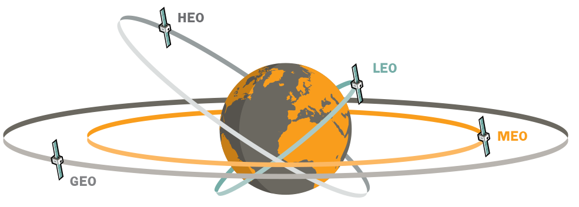

# Link Budget

## 2.1. Main formulas

Main formulas are performed via the following link

[CLICK HERE](https://drive.google.com/file/d/1cbl3Sw5rWS5RDas8-cLphX1sKKeqfmWg/view?usp=sharing) \(OPEN in Colaboratory or DOWNLOAD and open via Anaconda\)

Let us provide some parameters summary:

1. **Initial point:** carrier frequency,  hight of the orbit;
2. **Equipment dependent parameters \(ajustable\)**: transmitted power , receiver bandwidth ;
3. **Reference data:** antenna gains  ****and ****, sum of antenna losses and sky noise  noise figure  or noise temperature,  statistical parameters of the shadowing.

## 2.2. Considered equipment

In fact, we use common example of ground station such as IC-910H [\[1\] ](http://sicom.ru/catalog/radiostancii/lyubitelskie/bazovye/icom-ic-9100.html)or ISIS ground station[ \[2\] ](https://www.cubesatshop.com/product/full-ground-station-kit-vhfuhfs-band/)however we can estimate some parameter of mobile stations of real space communication systems also. Fortunately, a lot of this information is open and available on official sites [\[3\]](https://www.iridium.com%20), [\[4\],](https://www.globalstar.com) [\[5\]](http://www.gonets.ru/rus/%20).

These parameters can be used for calculation of up-link link budget.

For down-link estimation real example of CubeSat transceivers such as NanoCom AX100 [\[6\]](https://gomspace.com/Shop/subsystems/communication/nanocom-ant2000.aspx) \(fig. 2.4\) may be used. Additionally, as an example of CubeSat UHF/VHF antenna omnidirectional NanoCom ANT430 \(fig. 2.1\) can be considered [\[7\]](https://gomspace.com/Shop/subsystems/communication/nanocom-ant430.aspx).

For lager possible bandwidth 2.4GHz range also should be considered. For this range patch-antenna NanoCom ANT2000 and S-band transceiver NanoCom SR2000 are available[ \[8\]](https://gomspace.com/Shop/subsystems/communication/nanocom-sr2000.aspx) \(fig. 2.3\). For low speed transmission \(for example, for signaling\) UHF/VHF NanoCom ANT430 [\[9\]](https://gomspace.com/Shop/subsystems/communication/nanocom-ax100.aspx) \(fig. 2.2\) can be used.

## 2.3. Additional losses

Additional loses due to scattering in atmosphere can be compute by [\[10\]](https://www.itu.int/dms_pubrec/itu-r/rec/p/R-REC-P.676-11-201609-I!!PDF-E.pdf). Attenuations due to hydrometeors and other additional loses can be evaluated by [\[11\]](https://ieeexplore.ieee.org/document/6769991/). Fortunately, for ranges smaller than 10 GHz the losses are smaller than 1 dB.

![Fig. 2.5:  Specific attenuation due to atmospheric gases, calculated at 1 GHz intervals, including line centres \[10\].](.gitbook/assets/atten1.png)

![Fig.  2.6:  Zenith attenuation due to atmospheric gases, calculated at 1 GHz intervals, including line centres \[10\].](.gitbook/assets/atten2.png)

## 2.4 Results

Results are performed in tables 2.2-2.4 in the following pdf-file:

[Click here ](https://yadi.sk/i/SuZLOYhV3Qoy6o)

 Distance between satellite and ground station was fixed in value that is equal to height of the orbit \($$h$$\). More precise calculation of the distances in dependance of elevation angles \($$\phi$$\) can be provided according to [\[12\]](https://ieeexplore.ieee.org/document/7506756/):

$$
d = \sqrt{(R_E+h)^2-R^2cos^2\phi} - R_Esin\phi \qquad (1.1)
$$

 where __$$R_E$$ is the Earth radius.

  

If we assume that we consider environment without any influence of the atmosphere. Then circular velosity can be calculated via the classical way:

$$
v = \sqrt{G\frac{M}{R}} \qquad (1.3)
$$

 where $$G=6.67 \times 10^{-11} m^3 \times kg^{-1} \times s^{-2}$$  is the Gravity constant, $$M = 6\times 10^{24} kg$$  is the Earth mass and $$R = R_E + h$$  is the orbit radius \(Earth radius plus orbit heigh\).

As we see in the Figure 2.6 Doppler shifts for 2.4 GHz may be significant and therefore mitigation of the time selective fading techniques should be included in the final CubeSat configuration.

Based on knowledge about circular velocity and heigh of the orbit visibility time can be calculated. For trajectory that is shown in fig. 2.11 and 2.12 this can be done via [\[12\]](https://ieeexplore.ieee.org/document/7506756/):

$$
t=\frac{2(R_E+h)arccos(\frac{R_E}{R_E+h})}{v}
\qquad (1.4)
$$

  

![Fig. 2.12.  Schematic description of a CubeSat trajectory in low Earth orbit \[12\].](.gitbook/assets/cubetrraj.png)

Results are shown in fig. 2.13.

More representive form of values is shown in table 2.1

#### Table 2.1 Visibility time of CubeSats

| **Hight of the orbit \(km\)** | **Visibility time \(min\)** |
| --- | --- | --- | --- | --- | --- | --- | --- | --- | --- | --- | --- | --- | --- | --- | --- | --- | --- | --- | --- | --- | --- | --- | --- | --- | --- | --- | --- | --- | --- | --- | --- | --- | --- | --- | --- | --- | --- |
| 200 | 6.9 |
| 250 | 7.8 |
| 300 | 8.6 |
| 350 | 9.4 |
| 400 | 10.1 |
| 450 | 10.8 |
| 500 | 11.5 |
| 550 | 12.1 |
| 600 | 12.8 |
| 650 | 13.4 |
| 700 | 14 |
| 750 | 17.7 |
| 800 | 15.3 |
| 850 | 15.8 |
| 900 | 16.4 |
| 950 | 17 |
| 1000 | 17.6 |
| 1050 | 18.1 |
| 1100 | 18.7 |
| 1150 | 19.3 |
| 1200 | 19.8 |
| 1250 | 20.4 |
| 1300 | 20.9 |
| 1350 | 21.5 |
| 1400 | 22 |
| 1450 | 22.6 |
| 1500 | 23.1 |
| 1550 | 23.6 |
| 1600 | 24.2 |
| 1650 | 24.7 |
| 1700 | 25.3 |
| 1750 | 25.8 |
| 1800 | 26.3 |
| 1850 | 26.9 |
| 1900 | 27.4 |
| 1950 | 27.9 |
| 2000 | 28.5 |

##  References

\[1\] IC-910H specification                                       [http://sicom.ru/catalog/radiostancii/lyubitelskie/bazovye/icom-ic-9100.html](http://sicom.ru/catalog/radiostancii/lyubitelskie/bazovye/icom-ic-9100.html) \(date of the application is 27.06.2018\)

\[2\] ISIS CubeSate equipment technical specification                                                     [https://www.cubesatshop.com/product/full-ground-station-kit-vhfuhfs-band/](https://www.cubesatshop.com/product/full-ground-station-kit-vhfuhfs-band/) \(date of the application is 27.06.2018\)

\[3\] Official web-site of Iridium company                                                                                   [https://www.iridium.com](https://www.iridium.com/) \(date of the application is  27.06.2018\)

\[4\] Official web-site of Globstar company                                                                             [https://www.globalstar.com](https://www.globalstar.com/) \(date of the application is  27.06.2018\)

\[5\] Official web-site of Messenger company                                                                   [http://www.gonets.ru/rus/](http://www.gonets.ru/rus/) \(date of the application is  27.06.2018\)

\[6\] S-band patch antenna for high speed communication  by GomSpace company [https://gomspace.com/Shop/subsystems/communication/nanocom-ant2000.aspx](https://gomspace.com/Shop/subsystems/communication/nanocom-ant2000.aspx) \(date of the application is 27.06.2018\)

\[7\] Omnidirectional canted turnstile UHF antenna system by GomSpace company[https://gomspace.com/Shop/subsystems/communication/nanocom-ant430.aspx](https://gomspace.com/Shop/subsystems/communication/nanocom-ant430.aspx) \(date of the application is 27.06.2018\)

\[8\]  Flexible High Speed S-Band Radio Transceiver by GomSpace company [https://gomspace.com/Shop/subsystems/communication/nanocom-sr2000.aspx](https://gomspace.com/Shop/subsystems/communication/nanocom-sr2000.aspx) \(date of the application is  27.06.2018\)

\[9\] Flexible and Miniaturised Transceiver  by GomSpace company [https://gomspace.com/Shop/subsystems/communication/nanocom-ax100.aspx](https://gomspace.com/Shop/subsystems/communication/nanocom-ax100.aspx) \(date of the application is 27.06.2018\)

\[10\] Attenuation by atmospheric gases, ITU 2016                                         [https://www.itu.int/dms\_pubrec/itu-r/rec/p/R-REC-P.676-11-201609-I!!PDF-E.pdf](https://www.itu.int/dms_pubrec/itu-r/rec/p/R-REC-P.676-11-201609-I!!PDF-E.pdf) \(date of the application is 27.06.2017\)

 \[11\] D. O. Reudink Estimates of Path Loss and Radiated Power for UHF Mobile-Satellite Systems, The Bell system technical journal Vol. 62, No.8, October 1983 Printed in U.S.A.

\[12\] Otilia Popescuy, Jason S. Harrisz and Dimitrie C. Popescuz, Designing the Communica- tion Sub-System for Nanosatellite CubeSat Missions: Operational and Implementation Perspectives, 2016, IEEE  

