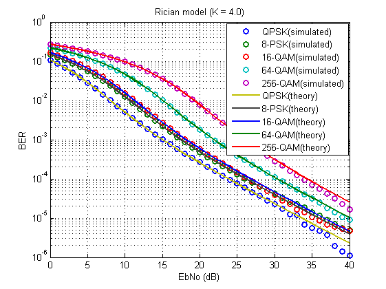
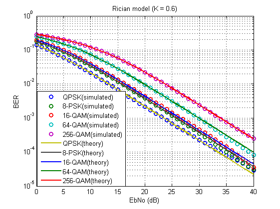
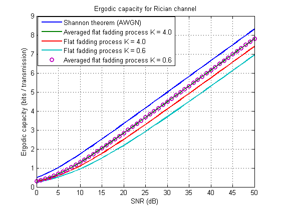

# Statistical channel model

## 3.1. Rician Model


Following matherials will be presented in absentia in X International Youth Forum "Education, Science and Production", timed to the 65th anniversary of BSTU n.a. V.G. Shukhov, which will be held from September 21 to September 27, 2018 within the framework of the VI Regional Science Festival in Belgorod at the Belgorod State Technological University named after. V.G. Shukhov \(BSTU named after V.G. Shukhov\).


According to [\[1\]](https://www.csie.ntu.edu.tw/~b92b02053/printing/summer/Materials/channel%20model/CHN_A%20statistical%20model%20for%20land%20mobile%20satellite%20channels%20and%20itsapplication%20to%20nongeostationary.pdf) the most appropriate channel model for LEO satellites is the mixture of the Rician and lognormal independent fading processes with two ultimate conditions: light shadowing and strong shadowing \(tab.1\). Moreover, shadowing \(lognormal part\) is negligible on elevation angles larger than 60 degrees \(and smaller than 120 degree\) \(fig. 3.1\) [\[1\]](https://www.csie.ntu.edu.tw/~b92b02053/printing/summer/Materials/channel%20model/CHN_A%20statistical%20model%20for%20land%20mobile%20satellite%20channels%20and%20itsapplication%20to%20nongeostationary.pdf).

![Fig. 3.1. Model parameters, sigma, mu,and K as a function of the elevation angle, a, in a mal tree-shadowed environment. \[1\]](.gitbook/assets/image%20%282%29.png)

 Table 1. Statistical characteristics of the LEO channel

| Parameter | Light shadowing | Strong shadowing |
| --- | --- | --- | --- |
|  Rician factor \(linear scale\) | 4.0 | 0.6 |
|  Lognormal mean \(linear scale\) | 0.13 | -1.08 |
|  Lognormal variance \(linear scale\) | 1.0 | 2.5 |

 Before we start consideration of the modeling, character of the selectivity should be considered.

#### Is the channel frequency selective?

To be frequecy flat the bandwith of the channel should not exceed coherence bandwith. In other words, symbol rate \(baud rate\) $$R_S$$  should be desirably selected according to the coherence bandwidth $$B_c$$ \(and hence according to the root mean square \(r.m.s.\) delay spread $$\sigma \tau_m$$ \) related restrictions \[2\]: 

$$
R_s \leq B_c \approx \frac{1}{10\sigma \tau_m} \qquad (3.1)
$$

Typical $$R_s$$ for CubeSat systems [\[3\]](https://gomspace.com/Shop/subsystems/communication/nanocom-sr2000.aspx) lies between 0.5 and 2 MBd \(S-band\) and this fact also relates to the measured coherence bandwidth Bc = 0.5 – 2 MHz \[4\].

#### Is the channel time selective?

To be time flate the symbol \(frame\) period should not exceed coherence time.  Coherence time can be estimated by the maximum Doppler shift \(according to Jakes model\) as $$T_c = \frac{1}{f_{D,max}}$$ . 

 Possible doppler shifts can be estimated by well-known formula:

$$
f_D = f_0\frac{v}{c}cos\phi \qquad (3.2)
$$

 where $$f_0$$  is the carrier frequency, $$c$$ is the speed of the electromagnetic wave, $$v$$ is the circular velosity of the satellite and $$\phi$$ is the elevation angle.


  
Symbol duration $$T_s$$should be at least 10 times smaller to avoid time selectivity \[2\]. For LEO orbits \(200-2000 km\) symbol duration will be approximately $$T_{s,max} = 1.6 \mu s$$ and therefore $$R_{s,min} = 625$$ kHz \(since $$R_s = 1/T_s$$ in case of linear modulation schemes\). That means that the channel is the time-flat in the range of $$R_s$$ from 625 kHz to 2 MHz.

#### To summarize

It makes scense to model Rician flat fading channel to estimate primaraly BER performance. Rician process  can be estimated based on described in [\[5\]](https://pdfs.semanticscholar.org/0fdd/65ed5a4e90f2ee44a1a0a8caa3f7021ce9f9.pdf)  ****common formula:

$$
\mathbf{H} = \sqrt{\frac{K}{K+1}}\mathbf{H_{LoS}} + \sqrt{\frac{1} {K+1}}\mathbf{H_{NLoS}}  \qquad (3.1)
$$

where $$\mathbf{H}$$ is the channel matrix,  $$K$$ is the Rician factor, $$\mathbf{H_{LoS}}$$ is the Line-of-Sight component and $$\mathbf{H_{NLoS}}$$is the Non-Line-of-Sight component \(actually, is the Rayleigh fading process\).

Channel model with simplification to **SISO** case will have the following form:

$$
r = \sqrt{\frac{K}{K+1}} + \sqrt{\frac{1}{2(K+1)}}(G_1+jG_2) \qquad (3.2)
$$

 since $$\mathbf{H_{LoS}} = e^{j2\pi 0dcos(\theta_r)}e^{j2\pi 0dcos(\theta_t)}=1$$ \( $$d$$ is the antenna spacing, $$\theta_r$$ is the Direction of Departure, $$\theta_t$$ is the Direction of Arrival\). $$G_1$$  and $$G_2$$ denote independent Gaussian processes.

For modeling of an additive noise Additive White Gaussian Noise \(AWGN\) model was selected:

$$
n = \sqrt{\frac{N_0}{2}}(G_3 + jG_4) \qquad (3.3)
$$

 where noise spectral density $$N_0 = \frac{E_s}{(E_b/N_0)log_2M}$$ , $$E_b/N_0$$  is the energy per bit to noise power spectral density ratio in linear scale, $$M$$ is the modulation order and $$ E_s = \frac{1}{L}\sum\limits^{L}_{K=1} |x_k|^2 $$  is the actual power of modeled signal \( $$x_k$$ is complex symbol and $$L$$is the length of signal \(block or frame\)\).

## 3.2. MATLAB script

```text
clear all
close all
clc

EbNo = 0:40;
K = [4.0; 0.6];
M = [4; 8; 16; 64; 256]; %Positions of modulation (M-PSK or M-QAM)

for k = 1:length(K)
    for m = 1:length(M)

        if M(m) >= 16    
            hModulator = comm.RectangularQAMModulator('ModulationOrder',M(m),'BitInput',false);
            hDemod = comm.RectangularQAMDemodulator('ModulationOrder',M(m),'BitOutput',false);
            ric_ber(:,m,k) = berfading(EbNo,'qam',M(m),1,K(k));

        else 
            hModulator = comm.PSKModulator('ModulationOrder',M(m),'BitInput',false); 
            hDemod = comm.PSKDemodulator('ModulationOrder',M(m),'BitOutput',false);
            ric_ber(:,m,k) = berfading(EbNo,'psk',M(m),1,K(k));
        end
    

        message = randi([0,M(m)-1],100000,1);
        mod_msg = step(hModulator,message);
        Es = mean(abs(mod_msg).^2);
        No = Es./((10.^(EbNo./10))*log2(M(m)));

        r = sqrt( K(k)/(K(k)+1)) + sqrt( 1/(K(k)+1))*(1/sqrt(2))*(randn(size(mod_msg)) + 1j*randn(size(mod_msg)));
        ric_msg = mod_msg.*r; % Rician flat fading

        for c = 1:100
            for jj = 1:length(EbNo)
                noisy_mod = ric_msg + sqrt(No(jj)/2)*(randn(size(mod_msg)) + 1j*randn(size(mod_msg))); %AWGN
                noisy_mod = noisy_mod ./ r; % zero-forcing equalization
                demod_msg = step(hDemod,noisy_mod);
                [number,BER(c,jj)] = biterr(message,demod_msg);
            end
        end
        sum_BER(:,m, k) = sum(BER)./c;
        reset(hModulator);
        reset(hDemod);
    end
end

figure(1) 

semilogy(EbNo,sum_BER(:,1,1),'o',EbNo,sum_BER(:,2,1),'o',EbNo,sum_BER(:,3,1),'o',EbNo,sum_BER(:,4,1),'o',EbNo,sum_BER(:,5,1),'o',...
         EbNo,ric_ber(:,1,1),'-',EbNo,ric_ber(:,2,1),'-',EbNo,ric_ber(:,3,1),'-',EbNo,ric_ber(:,4,1),'-',EbNo,ric_ber(:,5,1),'-','LineWidth', 1.5) 
title('Rician model (K = 4.0)') 
legend('QPSK(simulated)', '8-PSK(simulated)', '16-QAM(simulated)', '64-QAM(simulated)' ,'256-QAM(simulated)',...
    'QPSK(theory)','8-PSK(theory)', '16-QAM(theory)', '64-QAM(theory)' ,'256-QAM(theory)') 
xlabel('EbNo (dB)') 
ylabel('BER')
grid on


figure(2) 

semilogy(EbNo,sum_BER(:,1,2),'o',EbNo,sum_BER(:,2,2),'o',EbNo,sum_BER(:,3,2),'o',EbNo,sum_BER(:,4,2),'o',EbNo,sum_BER(:,5,2),'o',...
         EbNo,ric_ber(:,1,2),'-',EbNo,ric_ber(:,2,2),'-',EbNo,ric_ber(:,3,2),'-',EbNo,ric_ber(:,4,2),'-',EbNo,ric_ber(:,5,2),'-','LineWidth', 1.5) 
title('Rician model (K = 0.6)') 
legend('QPSK(simulated)', '8-PSK(simulated)', '16-QAM(simulated)', '64-QAM(simulated)' ,'256-QAM(simulated)',...
    'QPSK(theory)','8-PSK(theory)', '16-QAM(theory)', '64-QAM(theory)' ,'256-QAM(theory)') 
xlabel('EbNo (dB)') 
ylabel('BER')
grid on
```

## 3.3. Model verification

For verification of the proposal model we model random binary message \(length of the message equals to 100000 bits\), modulate it by pi/4-QPSK Gray mapping rule, multiply elementwise with fading process, add white gaussian noise, equalize by Zero-Forcing method, demodulate and calculate BER. The number of trials is equal to 100.





As we can see in figures 3.1 and 3.2 BER performance of the proposal approaches completely matched with theoretical \(**berfading\(\) function in MatLab**\) results.

## 3.4. Ergodic capacity limits

Ergodic capacity for our simplified channel model can be estimated cause of flat nature of considered fading process. For this we use following formula:

$$
C_{erg} = \frac{1}{2}E\left\{ log_2\left(1+|r|^2\frac{S}{N}\right)\right\}  \quad [bits/transmission] \qquad (3.2)
$$

where $$S/N$$ is the Signal to Noise Ration in linear scale,  $$r$$  is the fading process and $$E\{*\}$$ denotes expectation. Avereged ergodic capacity is provided just for illustration: 

$$
C_{erg} = \frac{1}{2}E\left\{ log_2\left(1+E\{|r|^2\}\frac{S}{N}\right)\right\}  \quad [bits/transmission] \qquad (3.3)
$$

 For AWGN channel capasity can be described via the Shannon theorem:

$$
C = \frac{1}{2}log_2\left(1+\frac{S}{N}\right)  \quad [bits/transmission] \qquad (3.4)
$$



To estimate capasity in bits per channel use we can use following formula based on [\[6\]](http://www.gatestudymaterial.com/study-material/communication%20systems/text%20books/Communication-Systems-4Th-Edition-Simon-Haykin-With-Solutions-Manual.pdf): 

$$
C_{erg} = \frac{1}{2}E\left\{ log_2\left(1+|r|^2\frac{S}{2W\frac{N_0}{2}}\right)\right\}  =  \frac{1}{2}E\left\{ log_2\left(1+|r|^2\frac{S}{WN_0}\right)\right\} \quad [bits/channel-use] \qquad (3.5)
$$

 where _W_ is the channel bandwidth.

To estimate capasity in bits second \(more common\) \(3.5\) should be multiplied  by sampling rate $$f_{samp} = 2W$$  \(by Kotelnikov / Nyquist criterion\):

$$
C_{erg} = WE\left\{ log_2\left(1+|r|^2\frac{S}{WN_0}\right)\right\} \quad [bits/s] \qquad (3.6)
$$

 Final values depend on channel bandwidth selection. Let us to fix it to 1 MHz.

## 3.5 Corazza-Vatalaro model


## References

\[1\] Giovanni E. Corazza and Francesco Vatalaro, A Statistical Model for Land Mobile Satellite Channels and Its Application to Nongeostationary Orbit Systems, Transac- tions on Vehicular Technology, vol. 43, no. 3. August 1994 

\[2\] Goldsmith A. Wireless communications. – Cambridge university press, 2005. – p. 88-92 

\[3\] GomSpace’s Flexible high speed S-band radio [transceiverhttps://gomspace.com/Shop/subsystems/com munication/nanocom-sr2000.aspx](transceiverhttps://gomspace.com/Shop/subsystems/com%20munication/nanocom-sr2000.aspx) \(the date of the application is 25.06.18\) 

\[4\] Kanatas A. G., Panagopoulos A. D. \(ed.\). Radio Wave Propagation and Channel Modeling for Earth–Space Systems. – CRC Press, 2016. - p. 107

\[5\] Farrokhi, Farrokh R., et al. "Spectral efficiency of FDMA/TDMA wireless systems with transmit and receive antenna arrays." IEEE transactions on wireless communications 1.4 \(2002\): 591-599.

\[6\]  Haykin S. Communication systems. – John Wiley & Sons, 2008. - p.366-368

